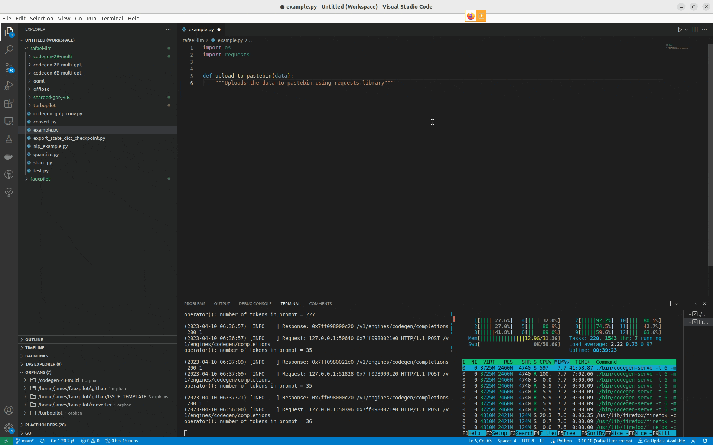

# TurboPilot

TurboPilot is a self-hosted [copilot](https://github.com/features/copilot) clone which uses the library behind [llama.cpp](https://github.com/comex/llama.cpp) to run huge [6 Billion Parameter Salesforce Codegen models](https://github.com/salesforce/CodeGen) in 4GiB of RAM. It is heavily based and inspired by on the [fauxpilot](https://github.com/fauxpilot/fauxpilot) project.

***NB: This is a proof of concept right now rather than a stable tool. Autocompletion is quite slow in this version of the project. Feel free to play with it, but your mileage may vary.***



## Getting Started

```bash
git clone https://github.com/ravenscroftj/turbopilot
git submodule init
cd ggml
mkdir build
cd build
cmake ..
make codegen codegen-quantize
```

## Getting The Models

Start by downloading either the [2B](https://huggingface.co/moyix/codegen-2B-multi-gptj) or [6B](https://huggingface.co/moyix/codegen-6B-multi-gptj) GPT-J versions of CodeGen.

## Convert The Model

```bash
python convert-codegen-to-ggml.py ./codegen-6B-multi-gptj 0
```

## Quantize the model

```bash
./bin/codegen-quantize ../../codegen-6B-multi-gptj/ggml-model-f32.bin ../../codegen-6B-multi-gptj/ggml-model-quant.bin 2
```

## Run the model

```bash
./bin/codegen -t 6 -m ../../codegen-6B-multi-gptj/ggml-model-quant.bin -p "def main("
```


## Acknowledgements

- This project would not have been possible without [Georgi Gerganov's work on GGML and llama.cpp](https://github.com/ggerganov/ggml)
- It was completely inspired by [fauxpilot](https://github.com/fauxpilot/fauxpilot) which I did experiment with for a little while but wanted to try to make the models work without a GPU
- The frontend of the project is powered by [Venthe's vscode-fauxpilot plugin](https://github.com/Venthe/vscode-fauxpilot)
- The project uses the [Salesforce Codegen](https://github.com/salesforce/CodeGen) models.
- Thanks to [Moyix](https://huggingface.co/moyix) for his work on converting the Salesforce models to run in a GPT-J architecture. Not only does this [confer some speed benefits](https://gist.github.com/moyix/7896575befbe1b99162ccfec8d135566) but it also made it much easier for me to port the models to GGML using the [existing gpt-j example code](https://github.com/ggerganov/ggml/tree/master/examples/gpt-j)